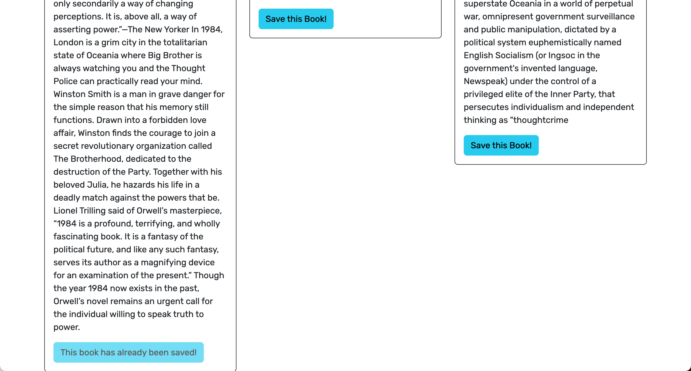
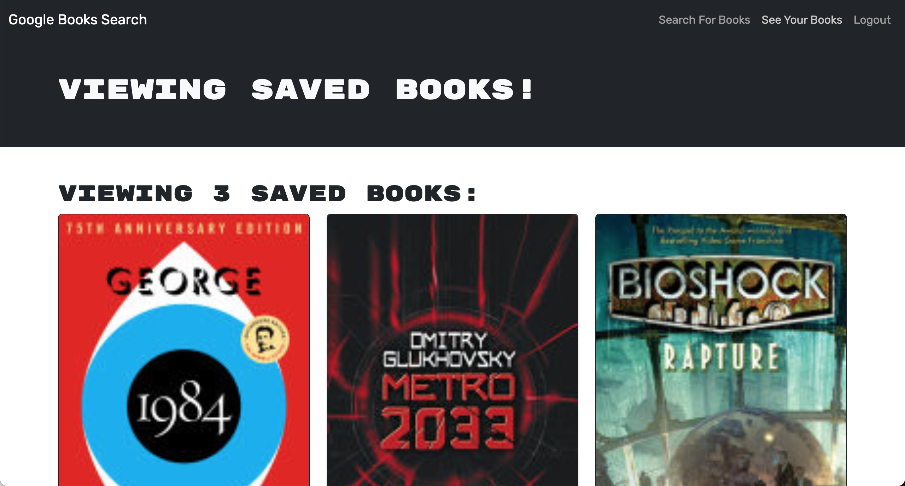
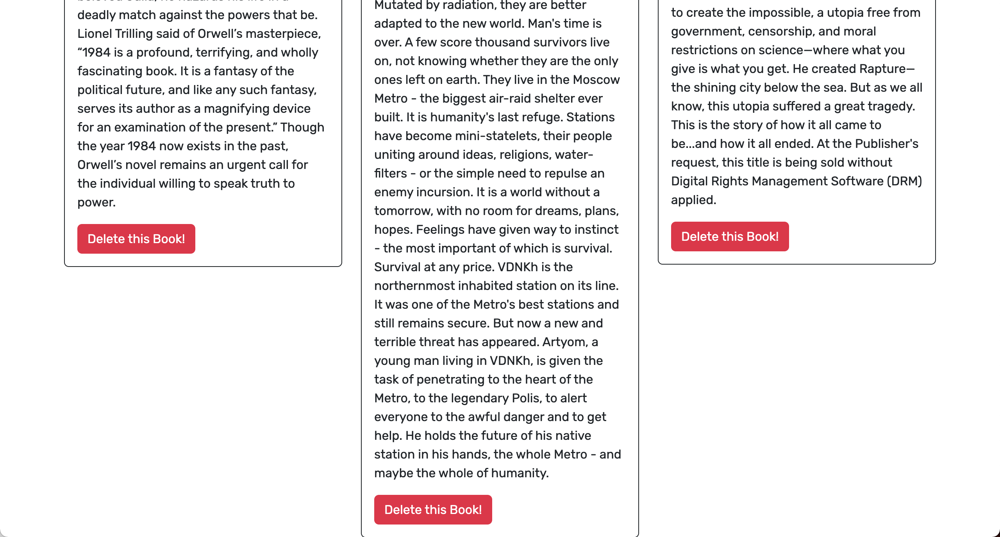

# Book Search Engine
[](https://opensource.org/licenses/MIT)

## Built With
[](https://www.mongodb.com/)
[](https://expressjs.com/)
[](https://react.dev/)
[](https://nodejs.org/en)
[](https://graphql.org/)
[](https://www.apollographql.com/)

## Description
The Book Search Engine is a web application built with the MERN stack (MongoDB, Express.js, React, Node.js) that allows users to search for books using the Google Books API. Users can create accounts, log in, search for books, save them to their account, and remove books from their saved list.

This project was initially developed with a RESTful API architecture but has been refactored to use GraphQL with Apollo Server for improved performance and flexibility. With GraphQL, users can efficiently fetch and modify data using queries and mutations, providing a more streamlined experience.

## Table of Contents
- [Installation](#installation)
- [Usage](#usage)
- [License](#license)
- [Contributing](#contributing)
- [Questions](#questions)

## Installation
To get started with the Book Search Engine, follow these steps:

1. Clone the repository to your local machine.
    ```bash
    git clone https://github.com/kyoriku/book-search-engine.git
    ```
2. Navigate to the project directory.
    ```bash
    cd book-search-engine
    ```
3. Install the required dependencies.
    ```bash
    npm install
    ```

## Usage
### Running Locally
- To run the project locally, use the following command:
  ```bash
  npm run develop
  ```
  This command initiates both the server and client development environments concurrently. It will launch the development server and open the Book Search Engine in your default web browser.

### Building for Production
- To build the project for production, use the following command:
  ```bash
  npm run build
  ```
  This command will create a production-ready build of the Book Search Engine, optimized for performance and ready to be deployed to your hosting provider.

### Screenshots






## License
This application is covered by the [MIT](https://opensource.org/licenses/MIT) license.

## Contributing
If you want to contribute to this project, follow these steps:

1. Fork the repository.
2. Create a new branch for your feature or bug fix.
3. Make your changes and commit them with descriptive commit messages.
4. Push your changes to your branch.
5. Submit a pull request, explaining your changes.

## Questions
If you have any questions, please contact [kyoriku](https://github.com/kyoriku) or email devkyoriku@gmail.com.